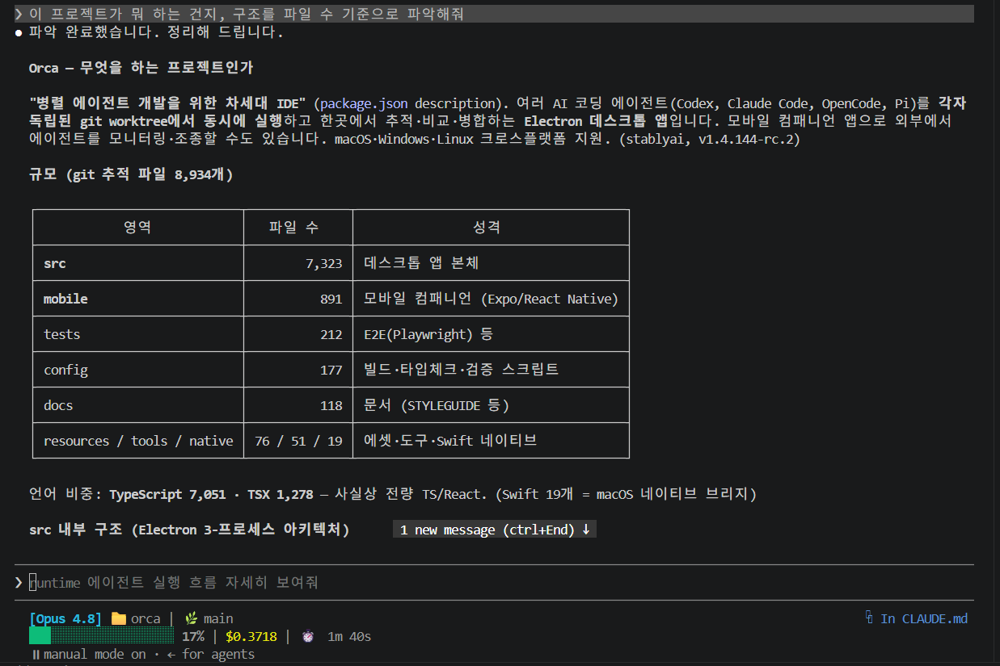

# Week 01 — 설치 & 첫 실습

- 작성자: InSooBeen
- 작성일: 2026-07-17

## 1. 환경 세팅 체크리스트

- [x] 설치 & 로그인 — `claude --version` 정상 출력 + `/login` 완료
- [x] VS Code 연동 — 확장 설치 & `Ctrl+Esc`로 패널 열림
- [x] `CLAUDE.md` 생성 — `/init` 실행해보기 (→ 아래 4번)
- [x] 첫 대화 & 첫 수정 — 프로젝트 설명 받고, diff 수락까지 완료 (→ 아래 3·4번)
- [x] git 커밋 위임 — Claude에게 커밋 맡겨보기 (→ 아래 4·6번)

## 2. 공식 문서 읽기

- [ ] [Quickstart](https://code.claude.com/docs) + CLI 기본 챕터

## 3. 직접 써보기 — 낯선 레포 파악시키기 (orca)

GitHub trending에서 **[stablyai/orca](https://github.com/stablyai/orca)** (TypeScript)를 clone하고,
Claude Code에게 "이 프로젝트가 뭐 하는 건지" 물어봤다. 처음 보는 8천 파일짜리 코드베이스를
얼마나 빨리 이해하는지 보는 게 목적이었다.

처음엔 `claude-code-templates`를 고르려다, 열어보니 코드가 아니라 마크다운·JSON 카탈로그라
"낯선 코드 이해하기" 실습엔 안 맞아서 실제 앱인 orca로 바꿨다.

**제일 신선했던 건 파악하는 방식**이었다. 나는 보통 README부터 읽는데, Claude Code는 구조를 *세는* 것부터 했다 —
확장자별 파일 수를 세서 "이건 TS 앱 / 저건 문서 카탈로그"를 판정하고, 디렉터리별 파일 수로 무게중심을 잡고,
`src/main` 하위 폴더 이름만 훑어서 지원하는 연동 목록(claude·codex·cursor…, github·gitlab…)을 뽑아냈다.
README에 뭐라 쓰였든 상관없이 파일 수부터 세는 접근이라, 나도 앞으로 낯선 레포를 볼 때 이렇게 해봐야겠다 싶었다.

<!-- 스크린샷: orca를 파악한 Claude Code 응답(파일 수 기반 요약 / 구조 표) -->


레포 자체에서도 하나 건졌다. orca의 `CLAUDE.md`가 **딱 한 줄(`@AGENTS.md`)**이었는데,
Claude Code는 `CLAUDE.md`를, 다른 도구는 `AGENTS.md`를 읽으니 한쪽을 import로 넘겨 규칙을 한 파일로 합쳐둔 거였다.
여러 에이전트를 지원하는 프로젝트다운 방식이라 메모해뒀다.

> 파일 수 표, 연동 목록, `AGENTS.md` 규칙 등 자세한 탐색 기록은 스크린샷으로 대체했다.

## 4. `/init` & 첫 수정 — 내 개인 레포(festra-perf)

`/init`이 "빈 프로젝트 초기화"인 줄 알았는데 아니었다. **지금 있는 코드·설정·문서를 읽어서
CLAUDE.md 초안을 뽑아주는** 거였다. 그래서 CLAUDE.md는 없지만 읽을 게 있는 레포를 찾다가,
성과 측정용 개인 레포 **festra-perf**(k6 스크립트 2개 + 설계 문서 `성과측정_설계.md`)에 돌렸다.

k6 스크립트만 요약할 줄 알았는데, 설계 문서까지 읽고 이 레포를 **왜 만들었는지**(측정 워크플로, 원칙,
도메인 경계 때문에 남은 TODO의 인과까지) 써놨다. 심지어 시키지도 않은 불일치를 하나 찾아냈다 —
"설계 문서 헤더엔 gitignore라 적혀 있는데 실제론 git이 추적 중"이라는 것. 직접 확인해보니 사실이었다.

**대신 실수도 있었다.** 아직 측정을 한 번도 안 한 레포인데, `/init`은 이걸 **이미 돌아가는 워크플로처럼**
써놨다. 설계서는 "이렇게 잴 것이다"라는 계획서인데, 그걸 "이렇게 잰다"는 현황으로 옮긴 것이다.

| CLAUDE.md의 서술 | 실제 |
|---|---|
| "`seeder/`로 더미 데이터 적재" | `seeder/`엔 README.md 하나뿐, 시더 없음 |
| "`results/`에 캡처" | `.gitkeep`만 있는 빈 폴더 |
| "팀 레포를 `local/perf-baseline` 브랜치로 체크아웃" | 그런 브랜치 없음 |

CLAUDE.md는 앞으로 매번 읽히는 파일이라, 계획을 사실처럼 적어두면 다음 작업 때 Claude가
"시더가 있다"고 믿고 시작한다. 틀린 게 문서에 박혀 돌아다니는 셈이라 **첫 수정으로 시제를 갈라놨다** —
"현재 상태 — 아직 틀만 잡힌 단계" 섹션을 추가하고, 제목에 `(계획)` / `(미작성)`을 붙였다.

<!-- 스크린샷: 첫 수정으로 CLAUDE.md에 추가한 '현재 상태' 표 -->


<!-- 스크린샷: 첫 수정 diff (계획 → 현황 분리) -->


커밋은 일부러 2개로 쪼갰다. `/init` 원본을 먼저 올리고 그 위에 수정을 얹으면 **2번 커밋의 diff 자체가
문제의 증거**가 된다. 둘 다 Claude에게 위임해 만들었다(체크리스트 "git 커밋 위임").

- `9212cf9` — /init으로 CLAUDE.md 생성 (원본 그대로)
- `982e46c` — CLAUDE.md에 현재 상태 명시 ← **수정 diff**

> `festra-perf`는 개인 private 레포라 커밋 링크는 첨부하지 않고 위 스크린샷으로 대신한다.

## 5. 다음 세션 공유거리

### 신기했던 것 — 요약을 시켰는데 검증까지 했다

`/init`에 시킨 건 "코드베이스 요약"인데, 설계 문서가 **자기 소개("이 문서는 gitignore된다")와
실제 git 추적 상태가 어긋난다**는 걸 시키지도 않았는데 찾아서 CLAUDE.md에 적어놨다.
문서에 적힌 주장을 곧이곧대로 옮기지 않고 실제 상태와 대조한 게 인상적이었다. 요약만 해줄 줄 알았는데.

### 이상했던 것 — 계획을 현황으로 옮겨 적었다

같은 `/init`이 정반대 실수도 했다. git 추적 상태는 실제로 대조해놓고, 정작 **디렉터리가 비었는지는
확인하지 않고** 설계서의 계획을 현황처럼 써놨다(시더도 결과도 브랜치도 없는데). 확인할 수 있는데 안 한 거다.
어디까지 검증하고 어디부터 문서를 그냥 믿는지, 그 경계가 예측이 안 됐다. `/init` 결과물은
**초안이지 완성품이 아니라는** 걸 배웠다.

## 6. 덤 — "커밋 위임"이 막혀 있었다

체크리스트 마지막 항목이 한동안 안 됐다. Claude에게 커밋을 시키면 `git add`가
**승인 프롬프트도 없이 그냥 거부**됐다. 원인은 예전에 넣어둔 `~/.claude/settings.json`의 안전 룰이었다:

```text
"deny": ["Bash(*dd *)", ...]
```

디스크를 덮어쓰는 `dd`를 막으려던 건데, Bash permission 룰은 명령의 의미가 아니라
**명령 문자열에 glob 패턴을 매칭**한다. 그래서 `git a`**`dd`**` ...` 안의 `dd `에도 걸려서
모든 `git add`가 차단되고 있었다. `deny`는 `ask`와 달리 묻지 않고 바로 막아서 프롬프트조차 안 떴다.

검증은 `git stage`(=`git add` 별칭, 철자에 `dd` 없음)로 했다 — 그건 바로 통과했다.
룰을 `Bash(dd *)` + `Bash(* dd *)`로 좁히니 `git add`도 정상 동작했고, 그제서야 커밋 위임이 됐다.

**배운 것**: 거부됐는데 프롬프트가 안 떴다면 `ask`가 아니라 `deny`다. 그리고 `*dd *`처럼
짧은 패턴은 언젠가 다른 단어 안에 끼어드니, 안전 룰일수록 좁게 써야 한다.
